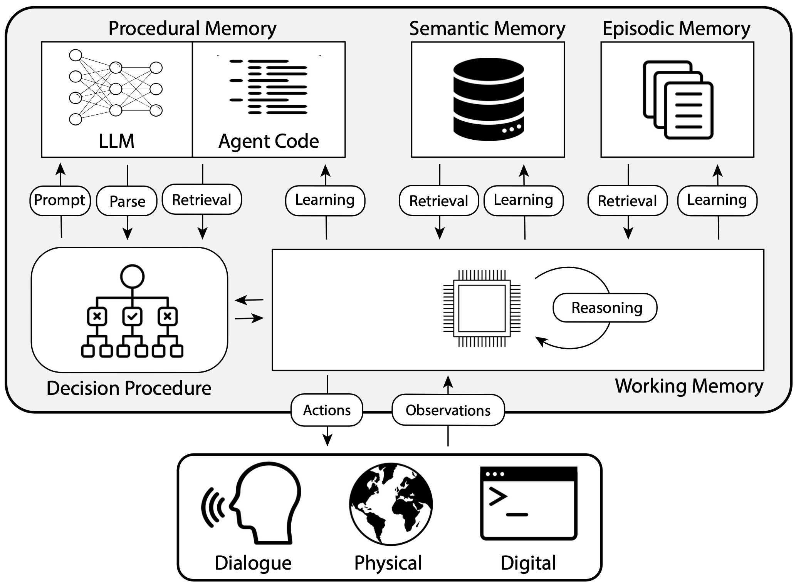
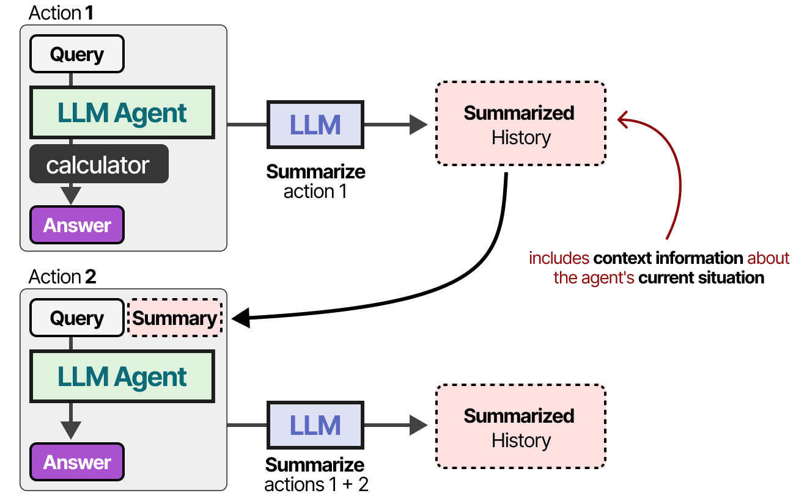
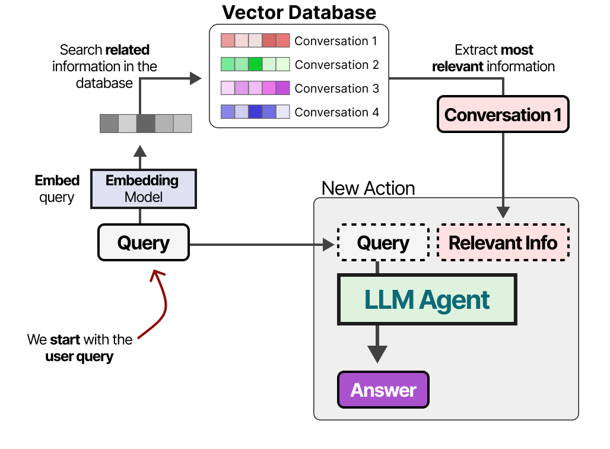

# Memory in LLM Agents


LLM agents often rely on **four types of memory** to reason, act, and adapt over time — inspired by how humans manage information.


### 1. Working Memory

A short-term mental notepad for holding information that’s relevant to the current task. It’s dynamic, constantly updated, and discarded once no longer needed.

**Examples:**
- **Math Solver:** Temporarily stores steps like `3 + 4 = 7`, then `7 * 2 = 14`.
- **Flight Booking Agent:** Holds "Current page: Flight Search" and "User wants to fly from NYC to SF on May 20" as it works.

### 2. Episodic Memory

Like a diary — stores past experiences, complete with context and time. Useful for recalling past interactions to improve future decisions.

**Examples:**
- **Chatbot:** Remembers "User asked about flights from NYC to SF on May 20."
- **Game Agent:** Logs "In level 3, opened left door and encountered a monster."
- **Personal Assistant:** Stores "Sarah prefers afternoon meetings."
  
<br>
<p style="text-align: center;">
  
</p>
<br>

### 3.  Semantic Memory

The agent’s internal knowledge base — facts, concepts, and long-term information about the world or user preferences.

**Examples:**
- **General Knowledge:** "Paris is the capital of France."
- **Code Assistant:** "map() is a built-in Python function."
- **Shopping Agent:** "This user prefers items under $500."

### 4. Procedural Memory

“How-to” memory — routines, skills, and procedures for executing tasks. This includes both learned behavior (model weights) and explicit rules.

**Examples:**
- **Prompt Templates:** Follows rules like "If the user says X, respond with Y."
- **Automation Agent:** Uses scripts to fill forms or navigate websites.

---

## Implementing Short Term Memory 

The short-term memory such as working and procedural can be enabled simply by the context length of the LLM. Modern LLMs have a context length in millions of tokens. 

<br>
<p style="text-align: center;">
  
</p>
<br>

However, episodic memory is a short to medium term memory involving past conversations and interactions. As such it maybe difficult to be stored in the context of the LLM. Therefore, we need to continuosly summarize the past interactions meaningfully to efficiently store them in the context length of the LLM.

<br>
<p style="text-align: center;">
  
</p>
<br>

The following code implements a simple memory class that continuously summarizes the past interactions fo efficent storage. 

```python
class Memory:
    def __init__(self, name, max_memory=1024):
        
        self.max_memory = max_memory
        self.name = name
        self.summarization_llm = LLM(
            name=self.name+'_summarization',
            system_desc=f"""
Your task is to briefly summarize the conversation history without losing important information.
Try to keep the summary concise and to the point.
""",
            response_format="text",
        )
        self.memory = ""

    def compute_tokens(self, text):
        return len(text.split())
    
    def fetch(self):
        return self.memory
    
    def commit(self, event):
        self.memory += event + "\n"

        if self.compute_tokens(self.memory) > self.max_memory:
            # Summarize memory if it exceeds max_memory
            printc(f"Memory exceeded for {self.name}. Summarizing...", color="yellow")
            summary = self.summarization_llm(self.memory)
            printc(f"Current memory size: {self.compute_tokens(self.memory)} tokens", color="yellow")
            self.memory = summary
```

## Implementing Long Term Memory
The long-term memory, such as semantic, is simply too much to be stored in the context of the LLM. Therefore, we need to store it in a database and retrieve it when needed. This approach is often referred to as **retrieval-augmented generation (RAG)**. 

<br>
<p style="text-align: center;">
  
</p>

The following code implements this functionality.

```python
class SemanticMemory:
    def __init__(self, name):
        self.name = name
        import os
        from langchain_openai import OpenAIEmbeddings
        from langchain_chroma import Chroma

        embeddings = OpenAIEmbeddings(model="text-embedding-3-large", 
                                      api_key=os.getenv("OPENAI_API_KEY"))
        
        os.makedirs(f"./tmp", exist_ok=True)
        self.vector_store = Chroma(
            collection_name=self.name+"_vectorStore",
            embedding_function=embeddings,
            persist_directory=f"./tmp/{self.name}_vectorStore.db",  
        )

    def build(self, files):
        from uuid import uuid4
        from langchain_core.documents import Document

        documents = []
        for path in files:
            with open(path, "r") as f:
                text = f.read()
                documents.append(Document(page_content=text, metadata={"source": path, "uuid": str(uuid4())}))
        self.vector_store.add_documents(documents)

    def fetch(self, query):
        results = self.vector_store.similarity_search(query, k=1)
        tmp=[]
        for res in results:
            tmp.append(res.page_content)
        return "".join(tmp)
```

---

## Adding Memory to Agent252D

We will now modify the Agent252D class to include the memory and semantic memory classes. The new class will be called `Agent252DWithMemory`. 

```python
class Agent252DWithMemory(Agent252DBase):
    def __init__(self, name, role):
        '''
        Implementation of Agent252D
        name: str - name of the agent
        role: str - role of the agent
        '''

        super().__init__(name, role)

        self.chat_history = Memory(name=self.name+'_chatHistory', max_memory=1024)   ## Episodic memory
        self.semantic_memory = SemanticMemory(name=self.name+'_semanticMemory')
        self.semantic_memory.build(["rag_example/india-france.txt", "rag_example/india-us.txt"])

    def build_context(self, user_input):
        context = self.chat_history.fetch()
        retrieved_context = self.semantic_memory.fetch(user_input)
        context = f"""
Interaction history:
{context}
Use the following context to answer the user's query.
{retrieved_context}
"""
        return context
    
    def __call__(self, input, caller="User"):
        printc(f"{caller}: {input}", color="yellow")
        self.chat_history.commit(f"{caller}: " + input)
        
        if self.core.should_terminate(input):
            self.chat_history.commit("Task completed.")
            printc(f"{self.name}: Task completed.", color="green")
            return
        
        else:
            response, code = self.generate_response(input)
            
        summary = self.core.summarize(input, response)
        self.chat_history.commit(f"{self.name}: {summary}")
        printc(f"{self.name}: {response}", color="blue")
        return summary
```

## Let's try it out!
```python
agent = Agent252DWithMemory(name="Agent252D", role="a helpful assistant")
agent.run()
# >> User: What is the capital of France?
# >> Agent252D: The capital of France is Paris.
# >> User: What is the capital of India?
# >> Agent252D: The capital of India is New Delhi.
# >> User: How are the relations between the above countries?
# >> Agent252D: India and France share a strong and strategic relationship. 
# The recent visit by Prime Minister Narendra Modi to France highlighted the deepening ties between the two countries. 
# Both leaders, PM Modi and President Emmanuel Macron, emphasized that India and France could be influential in driving global transformation. 
# Their discussions included strengthening defense partnerships, advancing nuclear cooperation, and enhancing economic corridors such as the India-Middle East-Europe Economic Corridor. 
# They also discussed global issues like climate change and AI risks.
#India and France are aligned in their approach to global challenges, seeking stronger engagement with the U.S. and China while maintaining independence from any single power. 
# Although they aim to maintain positive ties with the U.S., both countries are cautious of the unpredictable policies of the Trump administration. 
# Overall, India and France have a shared understanding of global challenges and are looking to collaborate on solutions.
```

This is great! Finally, we have an agent that can remember the past interactions and also has a semantic memory to store the long-term knowledge. 

---

## Longer Context lengths vs RAG

Given that modern LLMs have a context length of millions of tokens, one may argue against the need for RAG. However, there is scientific evidence that RAG is not only more efficient but also helps improve the accuracy of the LLMs.

<br>
<p style="text-align: center;">
  
</p>
<br>

---

📚 **References**
1. <a href="https://newsletter.maartengrootendorst.com/p/a-visual-guide-to-llm-agents#footnote-11-156659273">Exploring Language Models by MAARTEN GROOTENDORST</a>
2. Mialon et al., *Augmented Language Models: A Survey*, 2023.
3. Yu et al., *In Defense of RAG in the Era of Long-Context Language Models*, 2024.

---

## 🧭 What's Next?
Now that we know how to add memory to our agents, let's explore the use of tools in agents.

[Understanding Tool-use](tooluseagents)

---

**Author:** Kunal Gupta  
**Website:** [kunalmgupta.github.io](https://kunalmgupta.github.io)  
**Email:** [k5gupta@ucsd.edu](mailto:k5gupta@ucsd.edu)  
**GitHub:** [KunalMGupta](https://github.com/KunalMGupta)

---