# Enabling Planning/ Reasoning in an Agent
<br>
The ability to plan about its actions help an agent to effectively choose various tools and combine them to achieve a goal as well as adjust its plan based on environment feedback. We will first explore how to induce basic reasoning capabilities in LLMs. 


## Reasoning before Answering
<br>
"Reasoning" LLMs are those that tend to "think" before answering a question as shown below. 
<br>
<p style="text-align: center;">
  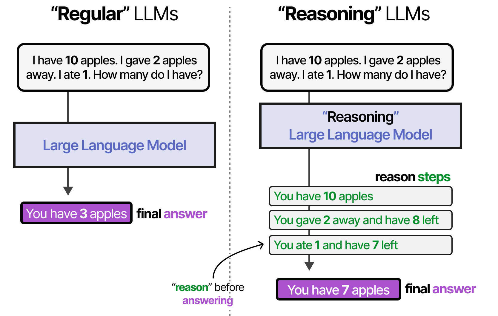
</p>
<br>

In practise, we find that the more an LLM spends time reasoning before answering, the better the answer it generates. This is because by creating more tokens beforehand that contain additional information, relationships, and new thoughts, the model spent more compute generating the final answer and thus the answer is more likely to be correct.

<br>
<p style="text-align: center;">
  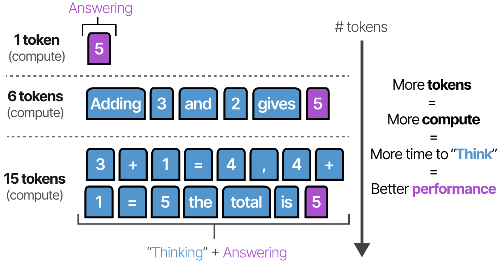
</p>
<br>

This is finding is corroborated by **Scaling Laws** of reasoning LLMs. 

<br>
<p style="text-align: center;">
  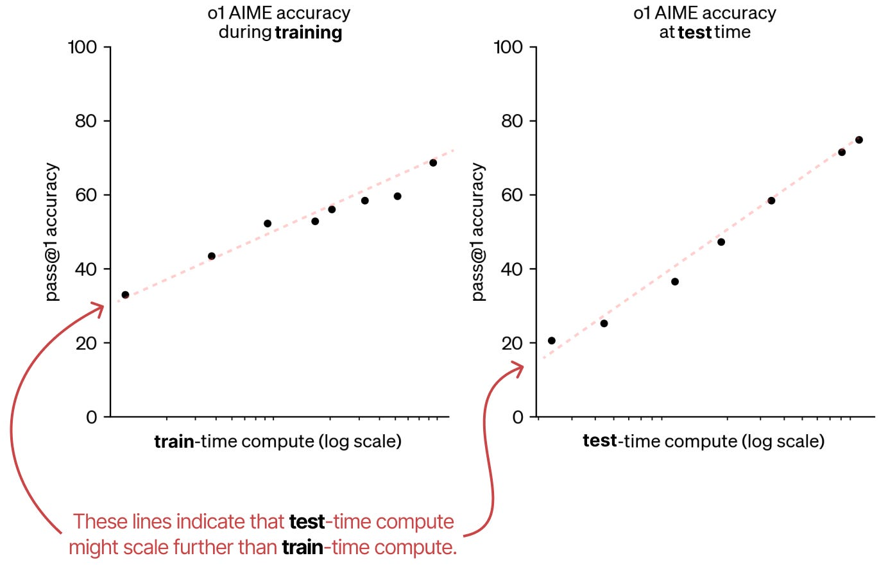
</p>
<br>

These findings are precisely why we lately see so many LLMs that are trained to "think" before answering.
<br>
<p style="text-align: center;">
  
</p>
<br>

---

## How to elicit reasoning in LLMs?
<br>
There are primarily two ways to elicit reasoning in LLMs:
- By finetuning them for reasoning tasks.
- By prompting them to reason before answering.

A great example of training for reasoning is DeepSeek-R1 where rewards are placed to encourage reasoning. The quality of `<think>` tokens is evaluated using Process Reward Models (PRMs) and the final `<answer>` tokens are evaluated using a separate Output Reward Model (ORM). Together they encourage the model to produce high quality reasoning and final output.

<br>
<p style="text-align: center;">
  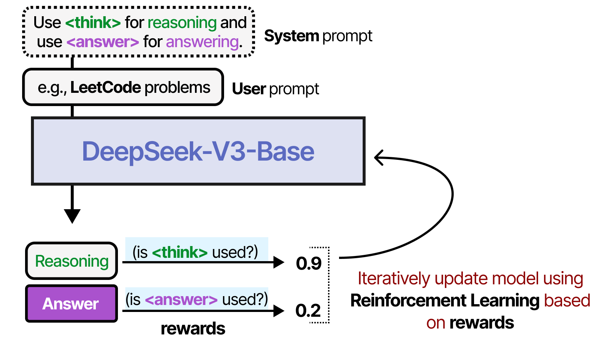
</p>
<br>

At test-time, reasoning can be elicited by prviding examples of the reasoning process that the LLM should follow. This is called **Chain-of-Thought (COT)** and enables more complex reasoning behaviour. 
<br>
<p style="text-align: center;">
  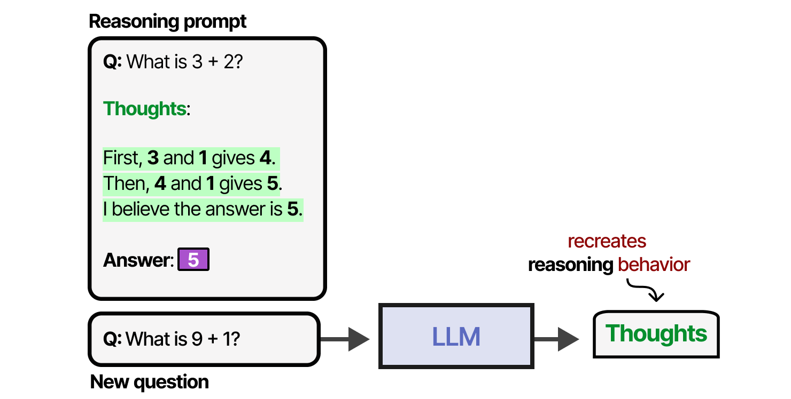
</p>
<br>
In fact, COT can be enabled even without examples (zero-shot prompting) by simply stating "Let's think step by step". 
<br>
<p style="text-align: center;">
  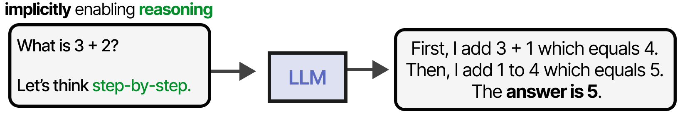
</p>
<br>


Note that in case of Agent252D, reasoning is done in the program space. In fact, we find that reasoning LLMs are equally better at writing code!


<p style="text-align: center;">
  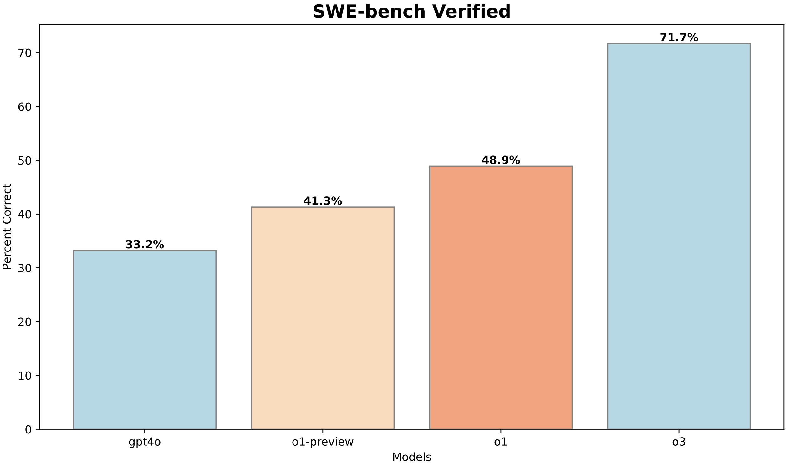
</p>
<br>

---

## Need for planning, isn't reasoning enough?
<br>
<blockquote style="text-align: left; font-style: italic; margin: 1em 0;">
  No plan survives first contact with the enemy.<br>
  — <strong>Helmuth von Moltke</strong>, <em>19th century Prussian military commander</em>
  <br><br>
  No plan survives first contact with the <del>enemy</del> environment.<br>
  — <strong>every LLM agent developer</strong>
</blockquote>
<br>

LLM agents are often deployed in complex environments where they need to adapt to changing conditions and unexpected challenges. Following illustration shows how the planning success drops as the environment becomes more complex. Moreover, performing even an isolated task requires using multiple tools and may not be feasible everytime — necessitating the need for planning and replanning.
<br>
<p style="text-align: center;">
  
</p>
<br>

---

## Combining Reasoning with Action: ReAct
<br>
One of the first techniques to combine both Reasoning and Actions was **ReAct**. Here reasoning and actions are interleaved, where the agent generates a reasoning step and then takes an action based on that reasoning. 
<br>
<p style="text-align: center;">
  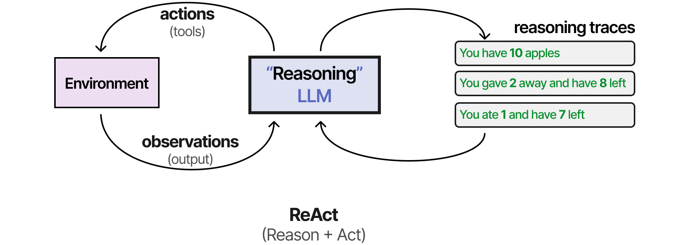
</p>
<br>

Such a behaviour is elicited by careful prompt engineering. The ReAct prompt describes three steps:
- Thought: A reasoning step about the current situation
- Action - A set of actions to execute (e.g., tools)
- Observation - A reasoning step about the result of the action

<p style="text-align: center;">
  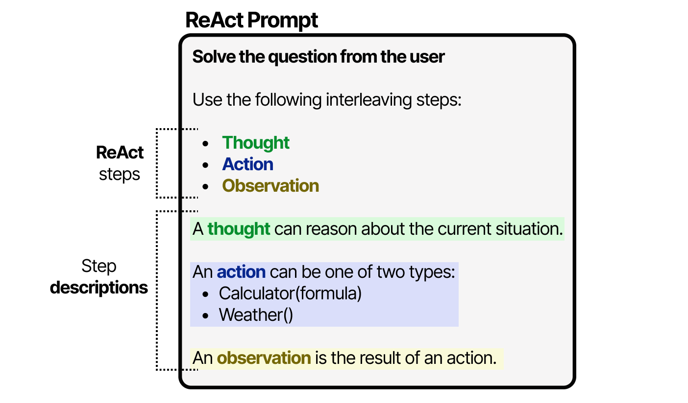
</p>

The LLM uses this prompt to steer its behaviors to work in cycles of thoughts, actions, and observations

<p style="text-align: center;">
  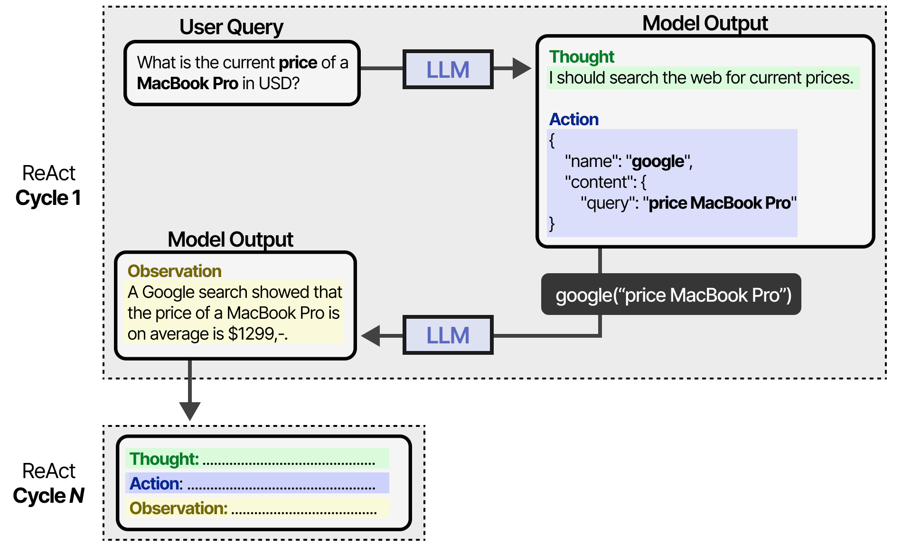
</p>

## Replanning 
<br>
While ReAct is great, at times it is important to adjust the plan based on the environment feedback. This is called replanning and is a key component of any agent. This is achieved by parsing the environment feedback via an LLM and generating a "refinement" text. The actor LLM can then use this refinement text to adjust its plan.
<br>
<p style="text-align: center;">
  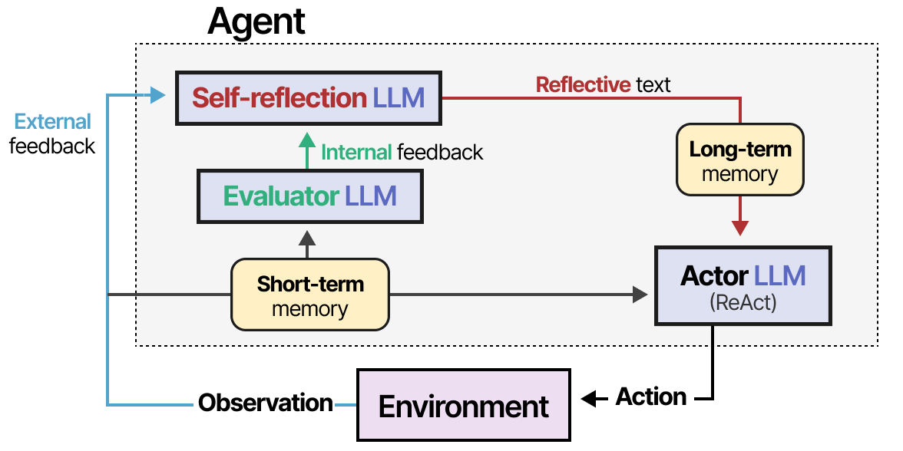
</p>

---

## Adding Planning to Agent252D
<br>
The Planner is designed to help refine code by evaluating its execution against a given task. It summarizes the outcome using an LLM-based task summarizer, which checks if the code succeeded and explains the result or error. If the code fails, the Planner generates a prompt to guide refinement based on the task, the original code, and the error output. This enables iterative improvement of code toward successfully completing the intended task.

```python
class Planner:
    def __init__(self, name, role):
        '''
        Implementation of a planner.

        name: str - name of the agent
        role: str - role of the agent
        '''

        self.name = name
        self.role = role

        self.set_task_summarizer()

    def refinement_prompt(self, user_input, code ,response):
        prompt = f"""
    We are trying to achieve the following task:
    {user_input}
    Earlier, your wrote the following code to achieve the task:
    {code}
    However, the code crashed with the following error:
    {response.response}
    Please refine the code to achieve the task.
    """
        return prompt
    
    def __call__(self, user_input, code, response):
       summary = self.summarize(user_input, code, response)
       
       if summary.status:
           return 0, summary.response
       
       elif not summary.status:
           summary.response = response
        
       prompt = self.refinement_prompt(user_input, code, summary)
       return -1, prompt
    
    def set_task_summarizer(self):
        from pydantic import BaseModel, Field

        class TaskSummary(BaseModel):
            status: bool = Field(description="Status of the code execution. Did the code run successfully? True if yes, False otherwise")
            response: str = Field(description=f"""
Response of the code execution. If the code ran successfully, then give a brief summary of the output that you see in light of the task. 
If the code execution failed, then simply return the error message.""")
            
        self.task_summarizer = LLM(
            name=self.name+'_taskSummarizerPlanning',
            system_desc=f"""
Your task is to go through the stdout of the executed code and generate a response for the intended task, for which the code was executed.
""",
            response_format="pydantic",
            use_cache=False,
        )

        self.summary_pydantic = TaskSummary

    def summarize(self, input, code, response):
        prompt = f"""
We are trying to achieve the following task:
{input}
Following is the code written by the agent:
{code}
Following is the output of the code execution:
{response}
Please summarize the output in light of the task.
"""
        return self.task_summarizer(prompt, pydantic_object=self.summary_pydantic)
           
```

Lastly, we will extend the Agent252D class to include the planner. In particular, it includes a `refine_with_planner` routine which helps refine the code based on the feedback from the planner.

```python
class Agent252D(Agent252DWithToolUse):
    def __init__(self, name, role):
        '''
        Implementation of Agent252D
        name: str - name of the agent
        role: str - role of the agent
        '''

        super().__init__(name, role)
        self.planner = Planner(name, role)
        self.MAX_REPLANNING = 3
    
    def refine_with_planner(self, input, code, response):
        status, response = self.planner(input, code, response)
        self.chat_history.commit(f"Planner: {response}")
        count = 0
        while status == -1:
            printc("*******************************************************", color="red")
            printc(f"The code crashed!", color="red")
            printc("{code}", color="red")
            printc(f"Errror: {response}", color="red")
            printc("*******************************************************", color="red")
            printc(f"Retrying...", color="red")
            self.chat_history.commit(f"{self.name}: Retrying...")
            response, code = self.generate_response(response)
            self.chat_history.commit(f"{self.name}: {response}")
            status, response = self.planner(input, code, response)
            self.chat_history.commit(f"Planner: {response}")
            count += 1
            if count > self.MAX_REPLANNING:
                break
        if status == -1:
            response += response + "\nFailed to serve user request."
        return response
    
    def generate_response(self, user_input):
        input = self.build_context(user_input)
        response, code = self.core(input)
        return response, code
    
    def __call__(self, input, caller="User"):
        printc(f"{caller}: {input}", color="yellow")
        self.chat_history.commit(f"{caller}: " + input)
        if self.core.should_terminate(input):
            self.chat_history.commit("Task completed.")
            printc(f"{self.name}: Task completed.", color="green")
            return
        else:
            response, code = self.generate_response(input)
            self.chat_history.commit(f"{self.name}: {response}")
            response = self.refine_with_planner(input, code, response)
        summary = self.core.summarize(input, response)
        self.chat_history.commit(f"{self.name}: {summary}")
        printc(f"{self.name}: {summary}", color="blue")
        self.chat_history.commit(f"{self.name}: {response}")
        return summary

```

---

## Let's see planner in action!
<br>
In order to simulate challenges from the environment, I have purposfully disabled the DetectionTool. As we will see, without a planner, the agent will not be able to complete the task. 
```python
agent1 = Agent252DWithToolUse(name="Agent252D", role="a helpful assistant")
agent1("I have 12 apples. if I distribute them to all animals shown in the image, how many would each get? image_path=/Users/kunalgupta/Documents/llm-agent-tutorial/assets/lions.png", caller="User")
# >> Agent252D: The task could not be completed because the detection tool required to identify the number of animals in the image is not implemented. 
# Therefore, it is not possible to determine how many apples each animal would get without knowing the number of animals.
```

However, we see that with the help of the planner, the agent is able to refine its code and complete the task. 
```python
agent1 = Agent252D(name="Agent252D", role="a helpful assistant")
agent1("I have 12 apples. if I distribute them to all animals shown in the image, how many would each get? image_path=/Users/kunalgupta/Documents/llm-agent-tutorial/assets/lions.png", caller="User")


# >>> Agent252D:
# *******************************************************
# The code crashed!
# {code}
# Errror: 
#     We are trying to achieve the following task:
#     I have 12 apples. if I distribute them to all animals shown in the image, how many would each get? image_path=/Users/kunalgupta/Documents/llm-agent-tutorial/assets/lions.png
#     Earlier, your wrote the following code to achieve the task:
    
# # Use the DetectionTool to determine how many animals are in the image
# image_path = "/Users/kunalgupta/Documents/llm-agent-tutorial/assets/lions.png"
# detected_objects = toolkit.DetectionTool(image_path, ["animal"])

# # Assuming the DetectionTool returns a structured string, extract the number of detected animals
# detected_count = detected_objects.count("animal")

# # Calculate how many apples each animal would get
# if detected_count > 0:
#     apples_per_animal = toolkit.CalculatorTool(12, detected_count, '/')
# else:
#     apples_per_animal = 0

# apples_per_animal

#     However, the code crashed with the following error:
#     Traceback (most recent call last):
#   File "/Users/kunalgupta/Documents/cse252d/tmp/Agent252D_executor_code.py", line 9, in <module>
#     detected_objects = toolkit.DetectionTool(image_path, ["animal"])
#   File "/Users/kunalgupta/Documents/cse252d/tools.py", line 51, in call_tool
#     return tool(*args, **kwargs)
#   File "/Users/kunalgupta/Documents/cse252d/tools.py", line 137, in __call__
#     raise NotImplementedError("DetectionTool is not implemented yet. Please use some other tool.")
# NotImplementedError: DetectionTool is not implemented yet. Please use some other tool.

#     Please refine the code to achieve the task.
    
# *******************************************************
# Retrying...
# Using code: 

# # Since the DetectionTool is not implemented, we will use the VQATool as a fallback to determine the number of animals
# image_path = "/Users/kunalgupta/Documents/llm-agent-tutorial/assets/lions.png"

# # Use the VQATool to ask how many animals are in the image
# question = "How many animals are in the image?"
# animal_count_response = toolkit.VQATool(question, [image_path])

# # Extract the number of animals from the response
# # Assuming the response is something like "There are X animals."
# import re
# match = re.search(r"There are (\d+) animals", animal_count_response)
# detected_count = int(match.group(1)) if match else 0

# # Calculate how many apples each animal would get
# if detected_count > 0:
#     apples_per_animal = toolkit.CalculatorTool(12, detected_count, '/')
# else:
#     apples_per_animal = 0

# apples_per_animal


# Agent252D: If you have 12 apples and distribute them evenly among 6 lions, each lion would receive 2 apples.
```

---

📚 **References**

1. [Exploring Language Models by MAARTEN GROOTENDORST](https://newsletter.maartengrootendorst.com/p/a-visual-guide-to-llm-agents#footnote-11-156659273)
2. *Learning to reason with LLMs*. OpenAI. 2024  
3. *Competitive Programming with Large Reasoning Models*. OpenAI. 2025  
4. *Describe, Explain, Plan and Select: Interactive Planning with Large Language Models Enables Open-World Multi-Task Agents*. Wang et al., 2024  
5. *Chain-of-Thought Prompting Elicits Reasoning in Large Language Models*. Wei et al., 2022  
6. *ReAct: Synergizing Reasoning and Acting in Language Models*. Yao et al., 2022  
7. *Reflexion: Language Agents with Verbal Reinforcement Learning*. Shinn et al., 2023  
8. *Self-Refine: Iterative Refinement with Self-Feedback*. Madaan et al., 2023  


---

## 🧭 What's Next?
Having built a fully functional agent, it is time to see what can we do with a mutli-agent framework!

[Multi-agent frameworks](multiagents)

---

**Author:** Kunal Gupta  
**Website:** [kunalmgupta.github.io](https://kunalmgupta.github.io)  
**Email:** [k5gupta@ucsd.edu](mailto:k5gupta@ucsd.edu)  
**GitHub:** [KunalMGupta](https://github.com/KunalMGupta)

---