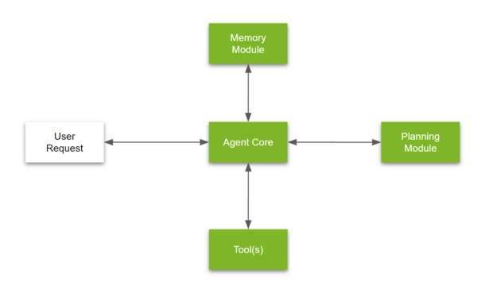

# Setting up Agent252D

<br>
What does it take to build an LLM Agent from scratch? What are standard techniques and terminologies used in their development? What are some state-of-the-art methods used for agent development? We will explore these questions in subsequent sections by building our own LLM agent — Agent252D.

But first, let's recap the key components of an LLM agent namely: 
- **Agent Core**: The core of the agent that contains the LLM and the logic to interact with it.
- **Tools**: The tools that the agent can use to perform tasks. These can be APIs, databases, or any other external resources.
- **Memory**: The memory of the agent that stores information about the tasks it has performed and the context of the conversation.
- **Planner**: The planner that decides the next steps for the agent based on the current context and the tools available.

<br>
<p style="text-align: center;">
  
</p>

## Agent Core
The Agent Core is the central control unit of the agent. It defines the agent’s behavior, decision logic, and how it interacts with the user. It includes:
- **LLM Synthesizer**: The core LLM engine that generates responses based on user input and the agent’s role.
- **Termination Checker**: A component that determines if the conversation should end based on user input.
- **Task Summarizer**: A component that interprets outputs and returns concise summaries of the tasks performed.

A basic implementation of the Agent Core is as follows:
```python
class BaseAgentCore:
    def __init__(self, name, role):
        self.name = name
        self.role = role

        ## Core LLM engine
        self.synthesizer = LLM(
            name=self.name+'_agentCore',
            system_desc=f"""
You are a helpful AI agent named {self.name}. Your role is {self.role}.
You are supposed to assist the user in achieving their goals.
""", 
        response_format="text",
        )

        ## LLM to check user intent to terminate the session
        self.task_terminate = LLM(
            name=self.name+'_taskTerminate',
            system_desc=f"""
Based on the user's input, determine if the user wishes to end the session in case they don't have further queries. 
Return True if the session needs to end, otherwise return False.
""",
        response_format="json",
        json_keys=["completed:bool"]
        )

        ## LLM to summarize the task
        self.task_summarizer = LLM(
            name=self.name+'_taskSummarizer',
            system_desc=f"""
Your task is to go through the stdout of the executed code and generate a response for the intended task, for which the code was executed.
""",
            response_format="text",
        )

    def __call__(self, input):
        response = self.synthesizer(input)
        return response, None
    
    def should_terminate(self, user_input):
        return self.task_terminate(user_input)["completed"]
    
    def summarize(self, input, response):
        prompt = f"""
We are trying to achieve the following task:
{input}
Following is the response generated:
{response}
Please summarize the output in light of the task. Be concise, don't have to tell me about various tool calls, etc. 
I am looking for a direct answer to the task. 
However, feel free to include intermediate reasoning steps if they are there. 
If there is a response that the input requests, please include that in the response.
Example responses:
"The product of 2 and 3 is 6."
"Here is the summary of the text: ..."
"""
        response = self.task_summarizer(prompt)
        return response
```

## Agent252D
The BaseAgent252D class wraps around the Agent Core to create a simple, interactive conversational agent. It manages the full dialogue loop between the user and the LLM agent.

Key Responsibilities:
- **Initialization**: Sets up the agent with a name and role, and initializes the core engine.
- **Context Construction**: Builds a prompt by combining user input with relevant context.
- **LLM Response Generation**: Delegates response generation to the core engine.
- **Session Termination Check**: Determines if the user wants to end the conversation.
- **Response Summarization**: Condenses the generated response into a concise, task-focused summary.
- **Interactive Loop**: Continuously accepts user input and responds until the session is explicitly ended.

```python
class Agent252DBase:
    def __init__(self, name, role):
        '''
        Basic implementation of Agent252D
        name: str - name of the agent
        role: str - role of the agent
        '''

        self.name = name
        self.role = role
        self.core = BaseAgentCore(name, role)

    def build_context(self, user_input):
        context = f"""
User: {user_input}
Use the following context to answer the user's query.
"""
        return context
    
    def generate_response(self, user_input):
        input = self.build_context(user_input)
        response, _ = self.core(input)
        return response, None
    
    def __call__(self, input, caller="User"):
        printc(f"{caller}: {input}", color="yellow")
        if self.core.should_terminate(input):
            printc(f"{self.name}: Task completed.", color="green")
            return True
        
        else:
            response, _ = self.generate_response(input)
            
        summary = self.core.summarize(input, response)
        printc(f"{self.name}: {summary}", color="blue")
        return summary

    def run(self): ## Agent loop
        while True:
            query = input("User Input: ")
            response = self(query, caller="User")

            if not response:
                break
```

## Let's try it out!
```python
agent1 = Agent252DBase(name="Agent252D", role="a helpful assistant")
agent1.run()

# >> User: What is the capital of France?
# >> Agent252D: The capital of France is Paris.
# >> User: What is the capital of India?
# >> Agent252D: The capital of India is New Delhi.
# >> User: How are the relations between the above countries?
# >> Agent252D: The response indicates that more information is needed to provide an answer about the relations between countries. 
# It asks for the specific countries in question to give a more detailed analysis of their relations.
```

This simple implementation seems to work fine, except for the fact that it doesn't have any memory. It doesn't remember the previous queries and responses!

---

## 🧭 What's Next?
Now let's see what happens when we give the agent some memory! 

[Adding memory](agentmemory)

---

**Author:** Kunal Gupta  
**Website:** [kunalmgupta.github.io](https://kunalmgupta.github.io)  
**Email:** [k5gupta@ucsd.edu](mailto:k5gupta@ucsd.edu)  
**GitHub:** [KunalMGupta](https://github.com/KunalMGupta)

---