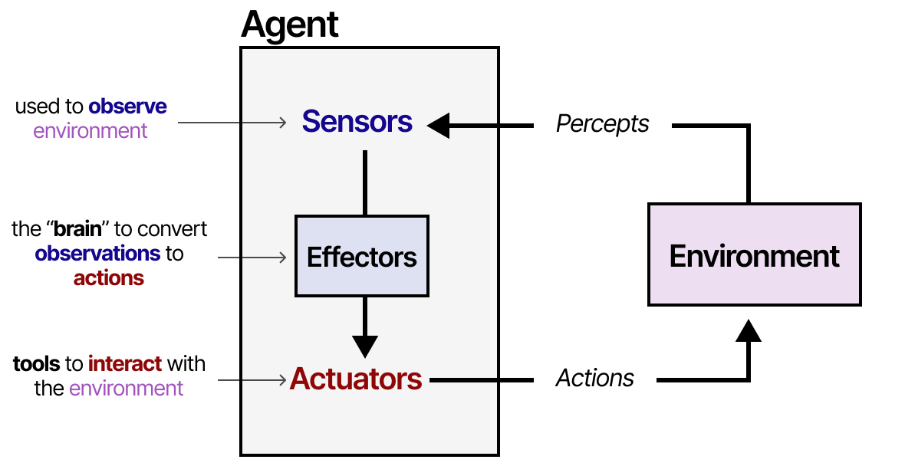
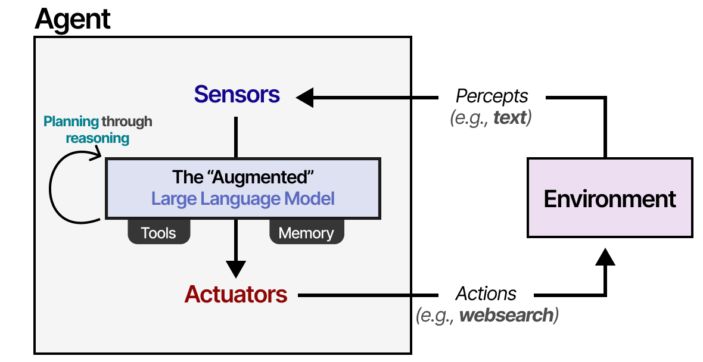
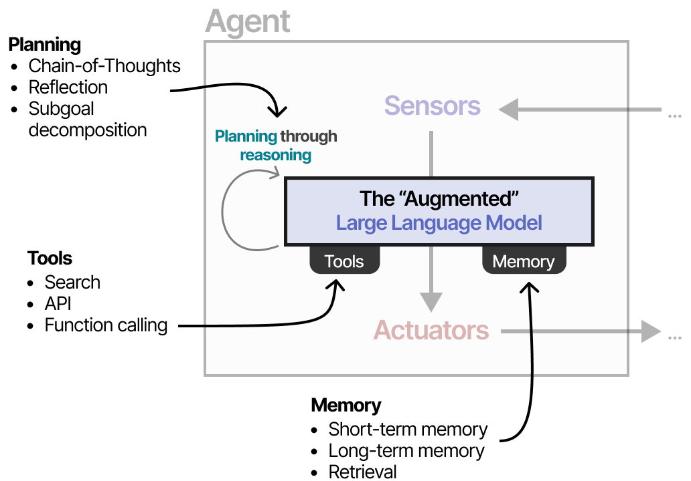

# What are LLM Agents?
 

  

<blockquote style="text-align: left; font-style: italic;">
  An agent is anything that can be viewed as perceiving its environment through sensors and acting upon that environment through actuators.  
  — <strong>Russell & Norvig</strong>, <em>AI: A Modern Approach</em> (2016)
</blockquote>
 

  

Agents interact with environments using sensors (to observe), actuators (to act), and effectors (to decide actions based on observations). This model applies to robots, software agents, and can be adapted to Augmented LLMs. In this context, the LLM Agent observes the environment through text input and acts via tools (like web search). Its ability to plan—using reasoning methods like chain-of-thought—is key to deciding which actions to take.

 

  

Thus we arrive at an Agent can decide next steps (planning), take actions (tools), and keep track of the taken actions (memory).

  

---

## Growing interest in LLM Agents and frameworks
 
 

  

   

 

  

   

---

📚 **References**
1. <a href="https://newsletter.maartengrootendorst.com/p/a-visual-guide-to-llm-agents#footnote-11-156659273">Exploring Language Models by MAARTEN GROOTENDORST</a>

---

## 🧭 What's Next?

In the next section, we’ll begin with setting up out very own LLM agent!

[Setting up Agent252D](agentsetup)

---

**Author:** Kunal Gupta  
**Website:** [kunalmgupta.github.io](https://kunalmgupta.github.io)  
**Email:** [k5gupta@ucsd.edu](mailto:k5gupta@ucsd.edu)  
**GitHub:** [KunalMGupta](https://github.com/KunalMGupta)

---