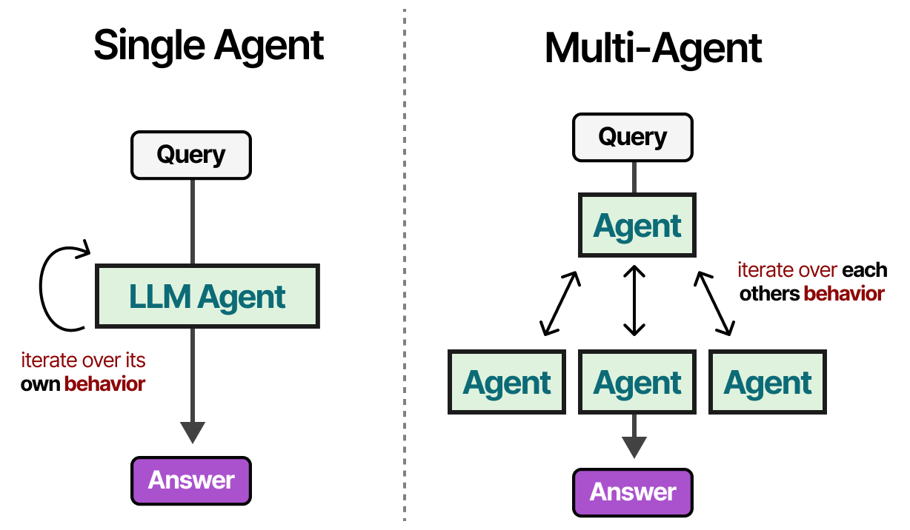
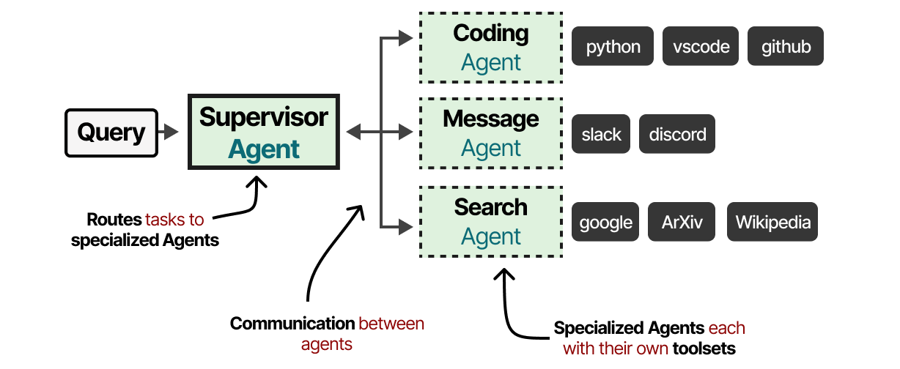

# Multiagent Frameworks
<br>

## Why do we need multi-agent frameworks?
<br>
While a single agent is quite capable, as we have seen in the previous sections, it is often not enough to solve complex tasks due lack of context, domain knowledge, or ability to use specific tools. In such cases, we need to combine multiple agents together to solve a task.

<br>
<p style="text-align: center;">
  
</p>
<br>

---

## Supervisor Agent
<br>

Each multi-agent framework must have a supervisor agent (or some other mechanism) to manage the communication between agents and to assign tasks to them. 
<br>
<p style="text-align: center;">
  
</p>
<br>

---

## Let's give Agent252D some friends!
<br>

But first, let's create a few more tools that we can use in our multi-agent framework. 
- `VQATool`: To answer generic questions about images, based on GPT-4o. 
- `LLMTool`: To process text based queries, based on GPT-4o.
- `textto3DModelTool`: To obtain 3D models from text queries, based on Hunyuan3D-1
- `AssembleSceneTool`: To perform basic scene assembly. 
  
Our agents will be part of a team which the supervisor will oversee. 
```python
class AgentTeam(Toolkit):
    def __init__(self):
        super().__init__()
        
    def register_agent(self, agent):
        agent.io = f"""
Input: str - Instructions to the agent
Output: str - Response from the agent
"""
        agent.demo = f"""
team.{agent.name}("What is 2+2?", caller="Supervisor") ## Always use the caller as Supervisor
"""
        self.register_tool(agent)
```

Now let's create a team of few agents and register them with the supervisor. 
```python

team = AgentTeam()
team.register_agent(agent1)
team.register_agent(agent2)   
team.register_agent(agent3)

supervisor = Agent252D(name="Supervisor", role="""
You are a supervisor agent that supervises the work of other agents.  
Given a user task, you should decide on the order in which various agents should be called. 
You are not supposed to perform any task yourself. 
""")
supervisor.toolkit = team
```

Allset! Now let's see how well our agents can work together. 

```python
supervisor("""
Can you create a 3D scene based on the image? 
I am only looking to place the various animals to form my scene.
Make sure to give them unique names. 
image_path=/Users/kunalgupta/Downloads/lions.png"""
, caller="User")

# >>> Supervisor:

# # Step 1: Use Agent1 to analyze the image and identify the animals
# image_analysis = team.Agent1("Identify the animals in the image located at /Users/kunalgupta/Downloads/lions.png", caller="Supervisor")

# # Step 2: Use Agent2 to create 3D models of the identified animals with unique names
# animal_models = team.Agent2(f"Create 3D models of the following animals with unique names: {image_analysis}", caller="Supervisor")

# # Step 3: Use Agent2 to assemble the 3D scene with the created models
# scene_assembly = team.Agent2(f"Assemble a 3D scene using models: {animal_models}", caller="Supervisor")

```
<div class="sketchfab-embed-wrapper">
  <iframe 
    title="six lions" 
    frameborder="0" 
    allowfullscreen 
    mozallowfullscreen="true" 
    webkitallowfullscreen="true" 
    allow="autoplay; fullscreen; xr-spatial-tracking" 
    xr-spatial-tracking 
    execution-while-out-of-viewport 
    execution-while-not-rendered 
    web-share 
    src="https://sketchfab.com/models/3e2ca7bda2db4db094e919660848d1d7/embed" 
    width="100%" 
    height="600">
  </iframe>
  <p style="font-size: 13px; font-weight: normal; margin: 5px; color: #4A4A4A;">
    <a href="https://sketchfab.com/3d-models/six-lions-3e2ca7bda2db4db094e919660848d1d7?utm_medium=embed&utm_campaign=share-popup&utm_content=3e2ca7bda2db4db094e919660848d1d7" 
       target="_blank" 
       rel="nofollow" 
       style="font-weight: bold; color: #1CAAD9;">six lions</a> 
    by 
    <a href="https://sketchfab.com/work.kunalg?utm_medium=embed&utm_campaign=share-popup&utm_content=3e2ca7bda2db4db094e919660848d1d7" 
       target="_blank" 
       rel="nofollow" 
       style="font-weight: bold; color: #1CAAD9;">work.kunalg</a> 
    on 
    <a href="https://sketchfab.com?utm_medium=embed&utm_campaign=share-popup&utm_content=3e2ca7bda2db4db094e919660848d1d7" 
       target="_blank" 
       rel="nofollow" 
       style="font-weight: bold; color: #1CAAD9;">Sketchfab</a>
  </p>
</div>

---

📚 **References**

1. [Exploring Language Models by MAARTEN GROOTENDORST](https://newsletter.maartengrootendorst.com/p/a-visual-guide-to-llm-agents#footnote-11-156659273)

---

## 🧭 What's Next?
We are done! Congratulations on completing the tutorial.
You are now ready to build your own LLM agents and multi-agent frameworks.

---

**Author:** Kunal Gupta  
**Website:** [kunalmgupta.github.io](https://kunalmgupta.github.io)  
**Email:** [k5gupta@ucsd.edu](mailto:k5gupta@ucsd.edu)  
**GitHub:** [KunalMGupta](https://github.com/KunalMGupta)

---