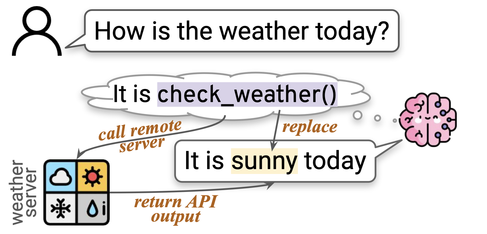
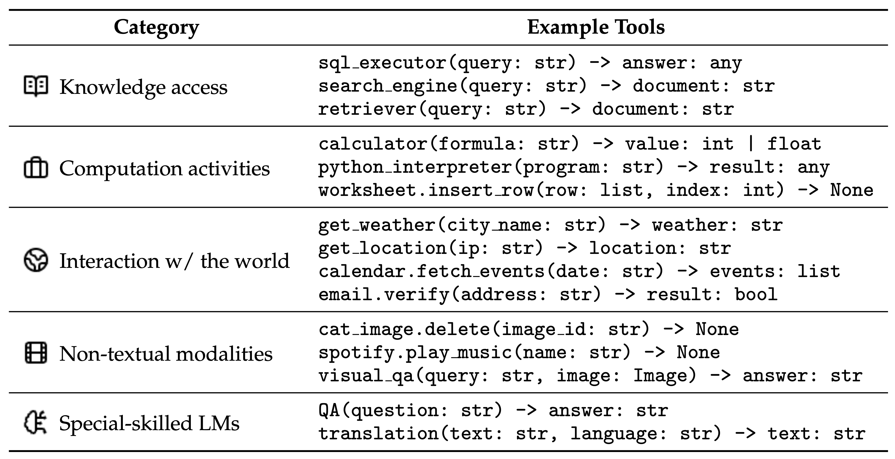
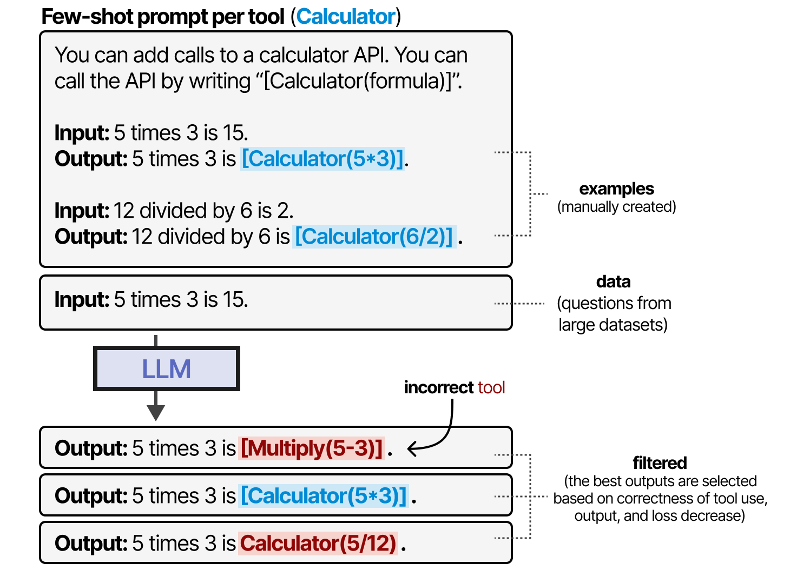
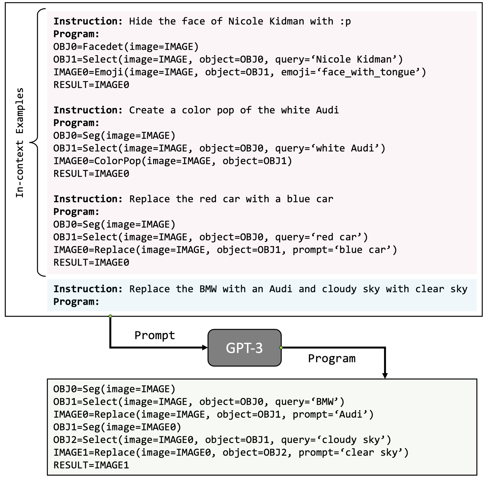
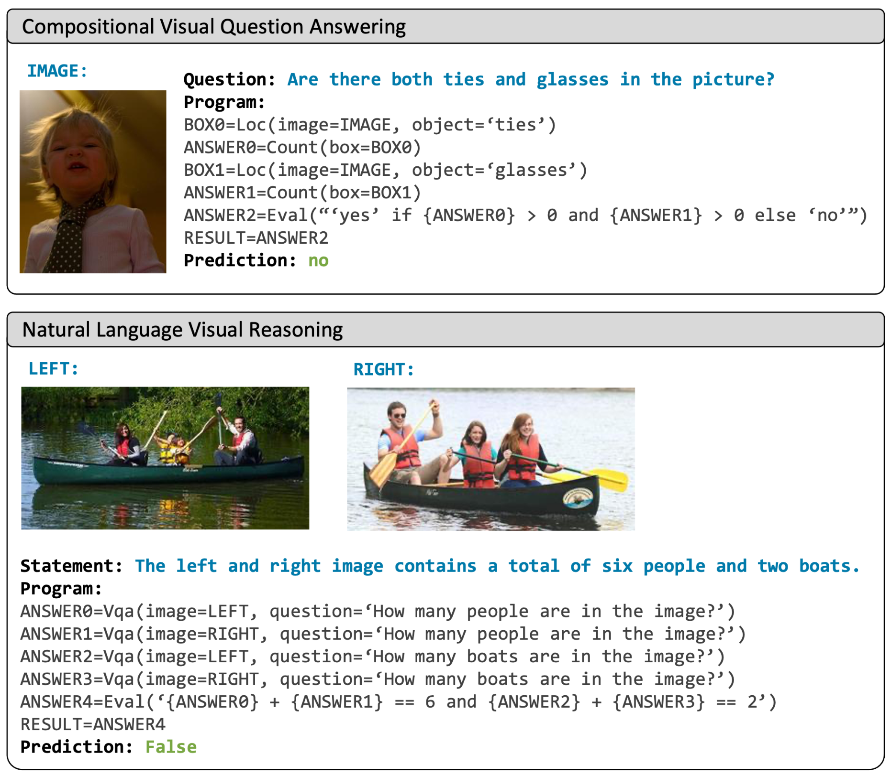

# Understanding Tool Use in Agents

## What is a Tool anyway?
 
<blockquote style="text-align: left; font-style: italic;">
  An LM-used tool is a function interface to a computer program that runs externally to the LM, where the LM generates the function calls and input arguments in order to use the tool.  
  — <strong>Wang et al.</strong>, <em>What Are Tools Anyway?</em> (2024)
</blockquote>
 

As such a **tool** is an external function or API that an LLM can call to fetch real-time or task-specific information that it cannot generate on its own. 

---

## How is a tool used?

Consider the following scenario, when a user asks an LLM **"How is the weather today?"**, instead of guessing, the LLM calls a `check_weather()` tool to fetch real-time data.

The process looks like this:
1. The LLM generates a tool call like: `check_weather("San Diego")`
2. The server executes the call and returns the result (e.g., `"sunny"`)
3. The LLM uses this result to complete its response:  
   → _"It is sunny today."_

 

  

 

This pattern, introduced by **Toolformer**, lets LLMs dynamically switch between generating text and calling tools, and is the fundamental mechanism underlying tool use in LLM agents. Tools can be defined and used across various categories, such as:

 

  

 

--- 

## Learning to use Tools: Toolformer

Toolformer is trained to use special tokens like `[`, `→`, and `]` to pause generation, invoke a tool (e.g., `multiply(5, 3)`), insert the result (e.g., `15`), and then resume generation. 

 

  

 

It uses a self-supervised fine-tuning approach to learn tool use from a large corpus of text, generating tool calls and filtering them for correctness and utility. 

 

  

 

Results clearly show that tool use in Toolformer leads to significant performance gains. 

 

  

 

Toolformer laid the foundation for more advanced systems like ToolLLM and Gorilla, which support large-scale and dynamic tool use.

---

## Tool use via prompting

Thanks to the surprising ability of LLMs to do *in-context learning*, we can also induce tool use by simply prompting them with examples. Consider VisProg, which writes programs for image processing tasks. Each program is a sequence of modules that perform specific tasks, like `Select`, `Replace`, or `ColorPop`. VisProg uses a few-shot prompting approach, where the LLM is given a few examples of how to use the modules. The LLM learns to generate the correct sequence of module calls based on the input image and task description.

 

  

 

VISPROG shows impressive performance on diverse set of tasks including image understanding and manipulation, knowledge retrieval, and arithmetic and logical operations.

 

  

 

---

📚 **References**
1. [Exploring Language Models by Maarten Grootendorst](https://newsletter.maartengrootendorst.com/p/a-visual-guide-to-llm-agents#footnote-11-156659273)
2. Mialon et al. (2023). *Augmented Language Models: A Survey*.
3. Yu et al. (2024). *In Defense of RAG in the Era of Long-Context Language Models*.
4. Wang et al. (2024). *What Are Tools Anyway? A Survey from the Language Model Perspective*.
5. Schick et al. (2023). *Toolformer: Language Models Can Teach Themselves to Use Tools*.
6. Gupta & Kembhavi (2022). *Visual Programming: Compositional Visual Reasoning Without Training*.

---

## 🧭 What's Next?
Time to give Agent252D some tools! 

[Adding tools](agenttools)

---

**Author:** Kunal Gupta  
**Website:** [kunalmgupta.github.io](https://kunalmgupta.github.io)  
**Email:** [k5gupta@ucsd.edu](mailto:k5gupta@ucsd.edu)  
**GitHub:** [KunalMGupta](https://github.com/KunalMGupta)

---